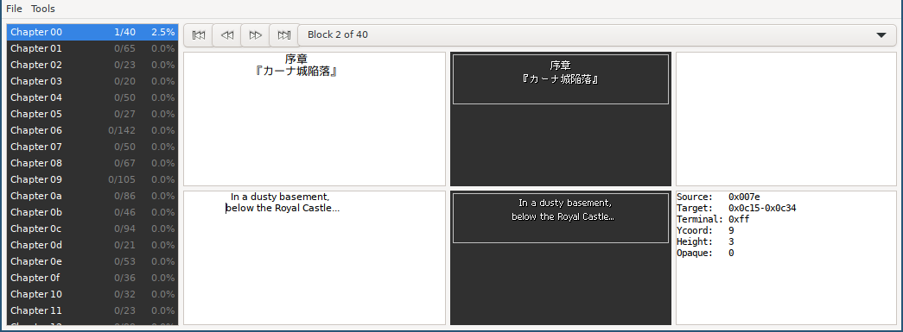
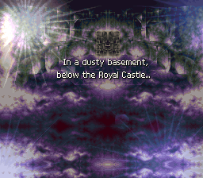
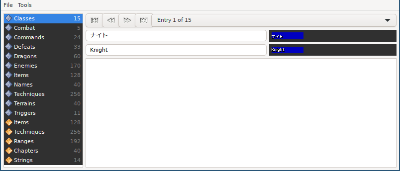

Bahamut Lagoon Translation Kit
==============================

This repository contains the source files
for Near's 2021 translation of Bahamut Lagoon.
for posterity,
for people who want to translate the game into other laguages,
and for SNES romhackers and homebrew developers
who want to learn the techniques Near used.

To learn more about the story behind this translation,
you might like to read the following articles:

  - [A 23-Year Perfectionist Journey to Localize the Obscure 'Bahamut Lagoon'][Vice]
  - [After 25 years, this cult SNES game finally gets a proper English translation][Input]

[Vice]: https://www.vice.com/en/article/bvxezw/a-23-year-perfectionist-journey-to-localize-the-obscure-bahamut-lagoon
[Input]: https://www.inputmag.com/gaming/after-25-years-this-cult-snes-game-finally-gets-a-proper-english-translation

Ingredients
-----------

In order to use this translation toolkit,
you'll need a few things:

  - An unmodified copy of the original Japanese release of *Bahamut Lagoon*
      - For legal reasons we can't point you to where to obtain this file,
        but its SHA256 hash is
        `a98eb5f0521746e6ce6d208591e86d366b6e0479d96474bfff43856fe8cfec12`
  - A computer with a C++ compiler and a POSIX runtime environment
      - On Ubuntu, you'll need the following packages installed:
          - build-essential
          - libgtk2.0-dev
          - libgtksourceview2.0-dev
          - libcairo2-dev
      - On other Linux or BSD systems,
        hopefully you can figure out your distro's equivalents
        for those packages.
      - On Windows,
        you'll need MSYS2 installed,
        and a GCC installed inside that
      - On macOS, you'll need Xcode?
  - A (real or virtual) SNES to test your translation-in-progress
      - An emulator like [bsnes] is recommended,
        but Snes9x, Mesen-S, and others are all fine choices
      - A real SNES with a flash-cart like an Everdrive or FX Pak is fine too
      - No ZSNES. Just, no.

[the hashes]: https://datomatic.no-intro.org/index.php?page=show_record&s=49&n=0152
[bsnes]: https://github.com/bsnes-emu/bsnes/releases

Setting up the environment
--------------------------

Before you start translating,
you'll need to build all the tools in the toolkit.
As well as the actual translation-editing tools,
the toolkit comes with appropriate versions of
the `bass` assembler
and the `beat` patch creation tool.
If you want to use your own versions
of those tools,
instead of the ones that come with the toolkit,
you'll need at least `bass` version 17 and `beat` version 2.

Assuming you've already checked out a copy of this repository,
the first thing we need is to install the `beat` patching tool:

    $ make -C beat install
    make: Entering directory 'beat'
    Compiling hiro/hiro.cpp ...
    [...]
    Compiling beat.cpp ...
    Linking out/beat ...
    mkdir -p ~/.local/bin/
    mkdir -p ~/.local/share/applications/
    mkdir -p ~/.local/share/icons/
    cp out/beat ~/.local/bin/beat
    cp resource/beat.desktop ~/.local/share/applications/beat.desktop
    cp resource/beat.png ~/.local/share/icons/beat.png
    make: Leaving directory 'beat'

The `[...]` in the above screenshot
marks where a bunch of harmless errors have been skipped.

To test that beat was installed correctly,
run it in your terminal:

    beat

You should get a new window titled "beat v2",
with options "Apply Patch", "Create Patch", and "Usage Instructions"
down the left-hand side.
We're not going to use the tool right now,
so just close the `beat` window.

We're also going to need the `bass` assembler.
First we need to build it:

    $ make -C bass install
    make: Entering directory 'bass'
    Compiling bass.cpp ...
    Linking out/bass ...
    cp out/bass ~/.local/bin/bass
    mkdir -p ~/.local/share/bass/architectures/
    cp -R data/architectures/* ~/.local/share/bass/architectures/
    make: Leaving directory 'bass'

Then we can run it,
to verify it installed correctly:

    $ bass
    bass v17

    usage:
      bass [options] source [source ...]

    options:
      -o target        specify default output filename [overwrite]
      -m target        specify default output filename [modify]
      -d name[=value]  create define with optional value
      -c name[=value]  create constant with optional value
      -strict          upgrade warnings to errors
      -benchmark       benchmark performance

If you get different output,
from either the "build" or "test" steps above,
something has gone badly wrong
and you need to fix it before you continue.

We also need to build the translation tools themselves.

    $ make -C bahamut/tools
    make: Entering directory 'bahamut/tools'
    Compiling hiro/hiro.cpp ...
    Compiling base56.cpp ...
    Compiling checksum.cpp ...
    Compiling compressor.cpp ...
    Compiling decompressor.cpp ...
    Compiling font-encoder.cpp ...
    Compiling font-extractor.cpp ...
    Compiling font-kerner.cpp ...
    Compiling list-editor.cpp ...
    Compiling list-encoder.cpp ...
    Compiling list-extractor.cpp ...
    Compiling script-editor.cpp ...
    Compiling script-encoder.cpp ...
    Compiling script-extractor.cpp ...
    Compiling string-scanner.cpp ...
    make: Leaving directory 'bahamut/tools'

Before we can use the translation tools,
you need to copy the unmodified original *Bahamut Lagoon* rom
into the `bahamut/jp/rom/` directory,
and make sure it's named `bahamut-jp.sfc`.

Building a patched ROM
----------------------

To build the translated version of the ROM,
run the following commands:

    $ make -C bahamut/tools build
    make: Entering directory 'bahamut/tools'
    out/base56
    out/font-encoder
    out/list-encoder
    out/script-encoder
    cd ../source && bass main.asm
    out/checksum
    make: Leaving directory 'bahamut/tools'

The initial state
-----------------

You can load the patched version of the game in an emulator
to check it's built correctly:

    $ bsnes bahamut/en/rom/bahamut-en.sfc

Once the game loads
and you get to the main menu,
select New Game,
and keep pressing buttons until you get to a blue dialog box
that's completely empty.
Where's the text?

The *Bahamut Lagoon* translation kit
is intended to help you translate into your language
from the original Japanese,
not to edit the English translation.
It includes English translations of items, menus and messages,
but not translations of dialog — those are all left blank.

If you don't know Japanese,
only English and your target language,
you can ask Tom ([@RetroTranslator] on Twitter)
for permission to base your work on his,
and he can send you the English script files.

[@RetroTranslator]: https://twitter.com/RetroTranslator

Editing the script
------------------

Now we know we can build a ROM,
we can start editing the translation.
To edit the first text-boxes that appear in the game,
launch the Script Editor:

    $ bahamut/tools/out/script-editor

You should see window that looks like this:

The window is divided into a number of sections:

  - On the left is a list of all the sections of the script,
    "Chapters" for normal interactions between characters
    and "Fields" for interactions in the middle of a battle
  - Each section is divided into "blocks",
    which are generally a single scene,
    with one or more dialog boxes,
    the "first", "previous", "next", and "last" buttons across the top
    let you browse the available blocks,
    and the drop-down list lets you jump to a particular block
  - The top-left panel shows the original Japanese text for this block
  - The top-middle panel shows how the original text
    was displayed by the original game
  - The top-right panel can be used to store
    translator's notes about this block,
    like identifying a particular name as a mythological reference,
    or when a particular line is a setup for or callback to
    to something later/earlier in the game
  - The bottom-left panel is where you type your translation
  - The bottom-middle panel shows how the new text will be displayed in-game
  - The bottom-right panel shows miscellaneous technical information
      - where is the FIRST pointer in the decompressed event code block for this text located?
      - where is the text within the block located?
      - what Y position does the dialogue box appear at?
      - is it on a transparent background or a text box?

To edit the first text in the game,
go to Chapter 00, Block 2 of 40.
This is the "Prologue" title-card in the official translation.
Put whatever text you like in the bottom-left pane.

The first actual dialog
is Chapter 00, Block 3 of 40,
Put some text in that block, too.

(see *Editing Reference* below
for details of formatting characters and codes you can use
in your script text)

When you're done editing the script,
choose "Save and Quit" from the File menu,
then rebuild the translated ROM:

    $ make -C bahamut/tools build

Now when you load the translated ROM
in your emulator of choice,
you should see the text that you entered
appear in-game!

Editing menus, items, and messages
----------------------------------

There's one other editor you should be aware of.
Besides the Script Editor we just looked at,
which lets you translate the main dialog of the game,
there's also the List Editor
which lets you translate menu entries,
item names,
and the like:

    $ bahamut/tools/out/list-editor

You should see window that looks like this:

Like the Script Editor,
there's a list of categories down the left hand side,
and first/previous/next/last buttons and a drop-down list across the top.
Below that,
we have the Japanese text on the left
and the in-game rendering on the right,
then the translated text and in-game rendering.
The big area at the bottom
is for tranlator's notes.

After making changes in the List Editor,
you'll need to choose "Save and Quit" from the File menu,
then rebuild the patch
in order to see the results.

Publishing
----------

When your translation is complete,
you'll want to share it with other people
so they can enjoy it.
It's not legal to give them the pre-patched ROM,
but you can make a patch that people can apply
to their own copies of the Japanese ROM.

    $ make -C bahamut/tools patch
    make: Entering directory 'bahamut/tools'
    Deleting ../en/rom/bahamut-en-patch.bps ...
    beat -create:bps ../en/rom/bahamut-en-patch.bps ../jp/rom/bahamut-jp.sfc ../en/rom/bahamut-en.sfc
    patch created successfully
    make: Leaving directory 'bahamut/tools'

This creates the file `bahamut/en/rom/bahamut-en-patch.bps`
which is the patch you can safely distribute.

Debugging mode
==============

The original game includes a debugging mode,
which allows you to jump between chapters
to easily test your script changes.

To enabled the debugging mode,
search for "enable the debugger"
in `source/main.asm`
and uncomment the following line.

Editing Reference
=================

Formatting
----------

When editing text,
there are some special codes you can use
for formatting and special effects:

  - `<` makes the following text italic
  - `>` makes the following text regular (non-italic)
  - `[` makes the following text yellow
  - `]` makes the following text white
  - `?` is a question-mark glyph whose width matches digit glyphs
  - `^` is a question-mark with a more natural width
  - `-` is a minus glyph whose width matches digit glyphs
  - `~` is a minus glyph with a more natural width
  - There's no special code for centering text,
    just use spaces

Note that
italics and yellow text can be combined however you like.
The `<` and `>` codes do not need to be matching pairs,
and neither do `[` and `]`.

Keyboard shortcuts
------------------

The following keyboard shortcuts are available:

  - Shift-F5: Jump to the first item of the category
  - F5: Jump to the previous item
  - F8: Jump to the next item
  - Shift-F8: Jump to the last item

TODO
====

Some things that would be handy to include in this documentation:

  - Other formatting codes, like pauses, etc.
  - What do those numbers in the bottom-right of the Script Editor mean?
  - More specific instructions for Windows
  - Describe how to use the debugging mode.
